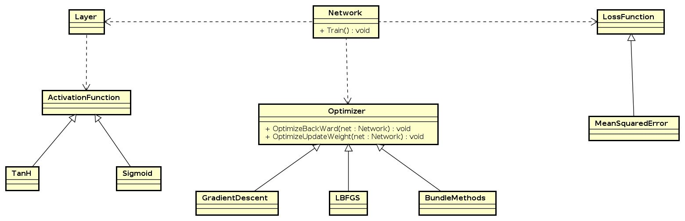

# Neuradillo 
For the Computational Mathematics for Learning and Data Analysis [course](https://esami.unipi.it/esami2/programma.php?c=42267&aa=2019&docente=FRANGIONI&insegnamento=&sd=) we expanded the functionality of [Neuradillo](https://github.com/GiovanniSorice/MLProject). Using [backpropagation](https://web.stanford.edu/class/psych209a/ReadingsByDate/02_06/PDPVolIChapter8.pdf) algorithm to compute the gradient, we added [L-BFGS](https://en.wikipedia.org/wiki/Limited-memory_BFGS) (following this [paper](https://github.com/FraCorti/CMProject/blob/master/paper/quasi-newton-NN-CM.pdf)) and [Proximal Bundle](https://en.wikipedia.org/wiki/Subgradient_method#Subgradient-projection_&_bundle_methods) optimization algorithms to train feedforward neural network. 

More information about the theory and the convergence analysis regarding the algorithms can be found in the [report](https://github.com/FraCorti/CMProject/blob/master/docs/report/report.pdf).

## Getting started

### Prerequisites 
The project use [CMake 3.16](https://cmake.org/) as building system, [Conan](https://conan.io/) as package manager and [GCC](https://gcc.gnu.org/) as compiler. The project has two types of builds: *Debug* and *Release*. The former can be used to debug the program if more functionalities need to be added, the latter is used to train the network and to obtain the benchmark values with all the [code optimization](https://gcc.gnu.org/onlinedocs/gcc-4.5.3/gcc/Optimize-Options.html) given by the compiler and the [OpenMP](https://en.wikipedia.org/wiki/OpenMP) library. 

### Armadillo installation 
1. Clone the following repo: https://github.com/darcamo/conan-armadillo
2. Inside the cloned repo run: `conan create . armadillo/stable`
3. If Armadillo is installed correctly an example program is executed and you can start using it [through Conan](https://docs.conan.io/en/latest/using_packages/conanfile_txt.html#requires). 
4. Check that the Armadillo version of the library installed through Conan is the same you have inside the `conanfile.txt` of the project. In [our case](https://github.com/FraCorti/CMProject/blob/master/conanfile.txt) the version is 9.800.2 but the Armadillo version downloaded through Conan can be different due to the remote repository update.  

### Gurobi installation 
The project uses [Gurobi](https://www.gurobi.com/) as an off-the-shelf solver for the *Master Problem* of the [bundle method](http://eprints.adm.unipi.it/2378/1/StandardBundle.pdf), it can be downloaded from [here](https://www.gurobi.com/downloads/gurobi-software/). This library is automatically linked to the project by CMake, but to do that few operations need to be made. Basically, CMake find Gurobi by looking at the file *FindGUROBI.cmake*, inside it you need to set the variable GUROBI_HOME to the path that leads to the folder where you have download Gurobi with the license of it in the upper folder. The license can be [downloaded for free](https://www.gurobi.com/downloads/end-user-license-agreement-academic/) from the Gurobi website if you are a university student/professor. 

For example, [in our case](https://github.com/FraCorti/CMProject/blob/master/cmake/FindGUROBI.cmake) the path to Gurobi is set as: */opt/gurobi902/linux64* and the license is saved at */opt/gurobi902*.

## Usage

### Running the project
If CMake and Armadillo were installed correctly you have to create a directory where CMake store the configuration files needed to run the project (Gurobi installation is not required unless you want to run Proximal Bundle method). So first we create the folder to store the file generated by CMake:
`mkdir build && cd build `

Inside the build folder to generate the files that are needed by Conan type: 
 `conan install ..`

Then the for the CMake files give: 
 `cmake .. -DCMAKE_BUILD_TYPE=Release/Debug` 

At the end to build the project type: 
 `cmake --build .` 

If all the process is done correctly a */bin* folder is created with a binary file inside. This file can be executed with:
`./CMProject`

The *Error* (plus the regularization term), *Gradient Norm* and *Computational time* values on the training set are printed during the execution.

## Plotting
To obtain the plots used in the report open [Gnuplot](http://www.gnuplot.info/) in the folder `docs/report/data/Comparison` and load the scripts with

`load "<script-name.gp>"`

Since the comparisons were made on the MONK's datasets the Gnuplot script files are all saved inside the `Comparison` folder inside the `Monk1`, `Monk2` and `Monk3` folders. All the data used to obtain the plots are saved inside the folder `docs/report/data`. Each algorithm has a folder that contains all the data obtained in Monk1, Monk2 and Monk3 on M1 and M2. For example the data obtained and the Gnuplot scripts for L-BFGS on Monk1 are stored inside the folder `docs/report/data/LBFGS/Monk1` . 

## Results
Here we show some plots we obtained during the optimization phase. 
 

## Project structure 
The project has the following structure: 

More optimizers can be added by creating a class that derives from the *Optimizer* abstract class that implement the pure virtual methods *OptimizeBackward(Network\*)* and *OptimizeUpdateWeight(Network\*)*. After that is sufficient to create the object *Network* and pass the new optimizer by using the method *SetOptimizer(Optimizer\*)*  before calling the public *Network* method *Train()* with all the parameters. 

## Acknowledgments
This project was developed for the course of [Computational Mathematics for Learning and Data Analysis](https://esami.unipi.it/esami2/programma.php?c=42267&aa=2019&docente=FRANGIONI&insegnamento=&sd=0) at the University of Pisa under the guide of [Prof. Antonio Frangioni](http://pages.di.unipi.it/frangio/) and [Prof. Federico Poloni](http://pages.di.unipi.it/fpoloni/).

## Authors
* **Giovanni Sorice**  - [Giovanni Sorice](https://github.com/GiovanniSorice)
* **Francesco Corti**  - [FraCorti](https://github.com/FraCorti)